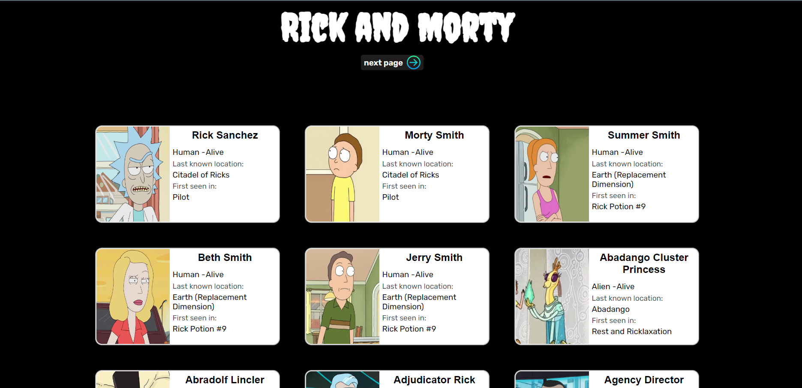
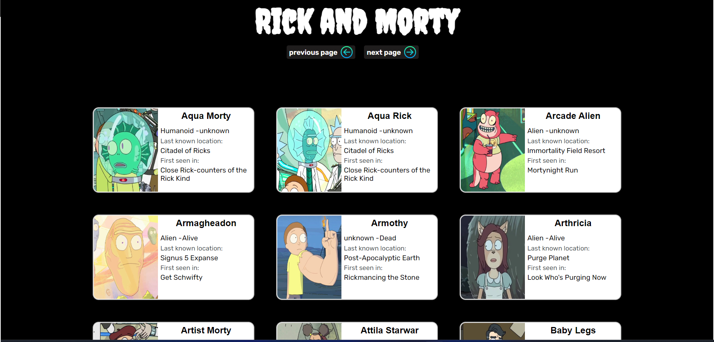

# Consumo-API
Este projeto serviu para aprender os conceitos basicos de uma API REST, nele, foi consumindo um Web Service atraves do Front-End usando JavaScript.

O site utilizado para consumo de API está disponivel no seguinte link:

* [The Rick and Morty API](https://rickandmortyapi.com/)
* [Documentação da API](https://rickandmortyapi.com/documentation)

## Imagem do projeto.
  
  
 
